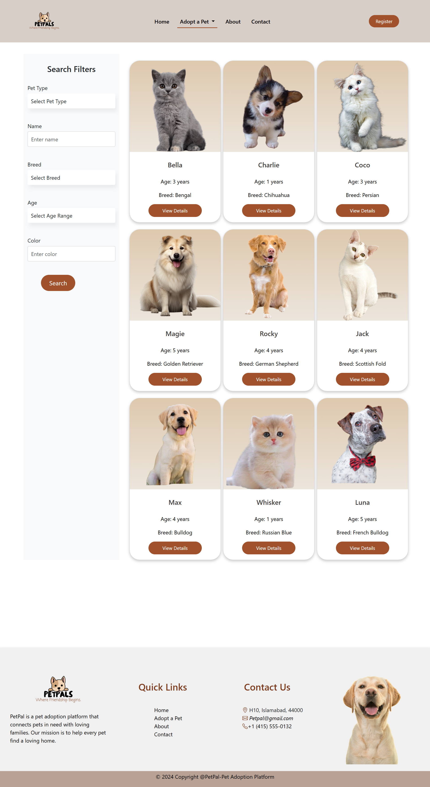

# PetPal - Pet Adoption Platform

Welcome to **PetPal**, your go-to platform for pet adoption. Our mission is to connect loving homes with pets in need. Whether you are looking to adopt a pet or find a new home for one, PetPal is here to help.

## Project Description
PetPal is a comprehensive pet adoption platform designed to facilitate the adoption process. Users can browse available pets, search based on specific criteria, view detailed profiles, and contact shelters or pet owners directly. The platform aims to streamline the adoption process and make it easier for pets to find new, loving homes.

## Technologies Used
- **Frontend**: HTML, CSS3, JavaScript, jQuery, Bootstrap 5
- **Backend**: PHP, MySQL

## Current Development
- Working on backend functionality
- Implementing admin dashboard
- Working on login and registration pages authentication

## Home Page Image
Here is a screenshot of the `index.php` page:

## Adopt Page Image
Here is a screenshot of the `adopt.php` page:

## Contact Page Image
Here is a screenshot of the `contact.php` page:

## Login/Signup Page Image
Here is a screenshot of the `contact.php` page:

## Admin Dashboard Page Image
Here is a screenshot of the `admin_dashboard.php` page:

## Manage Pets Page Image
Here is a screenshot of the `manage_pets.php` page:

